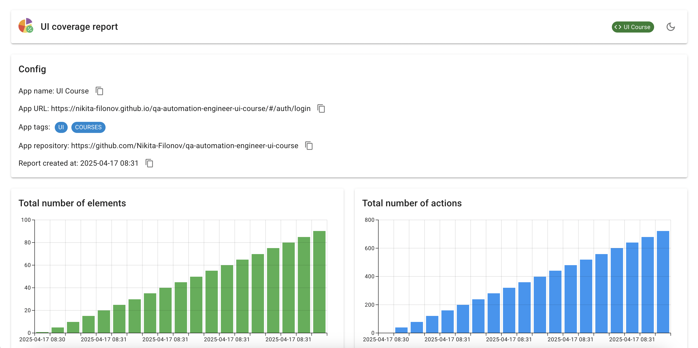
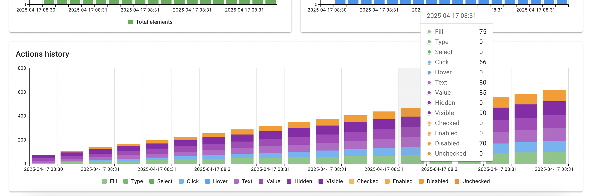
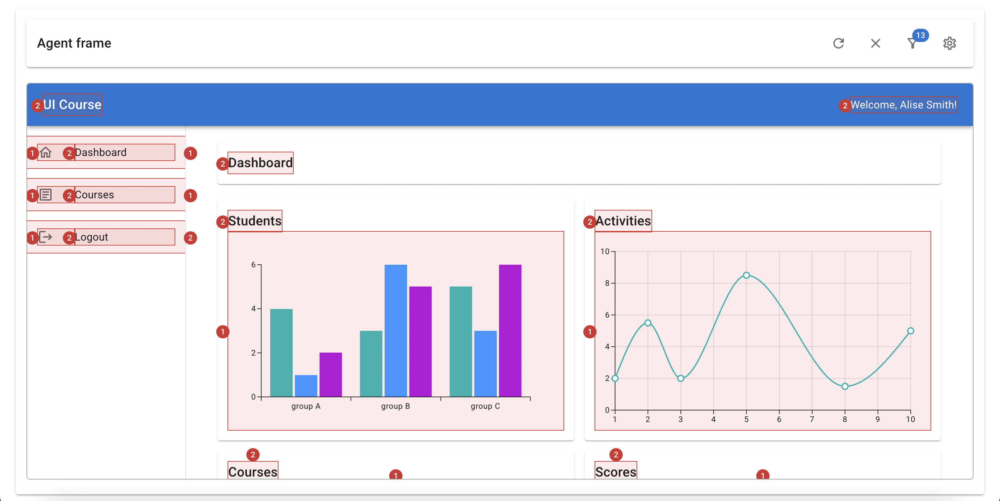
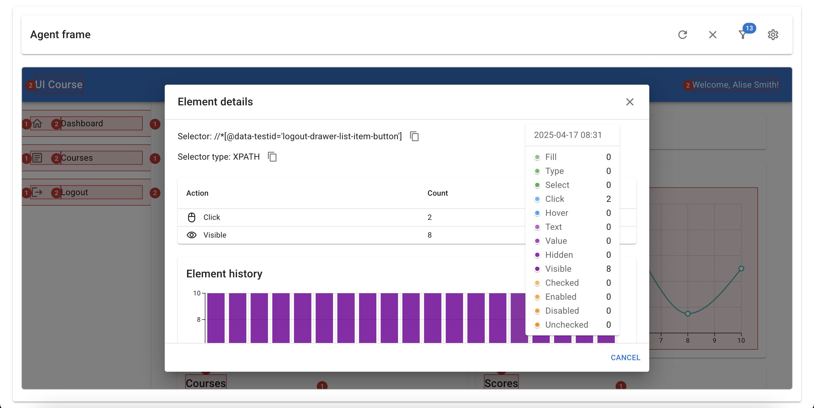
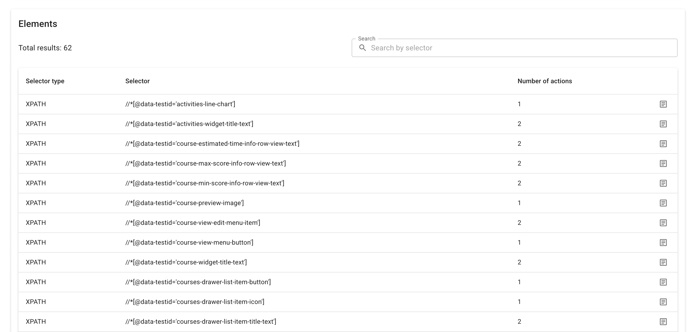

# UI Coverage Tool

**UI Coverage Tool** is an innovative, no-overhead solution for tracking and visualizing UI test coverage — directly on
your actual application, not static snapshots. The tool collects coverage during UI test execution and generates an
interactive HTML report. This report embeds a live iframe of your application and overlays coverage data on top, letting
you see exactly what was tested and how.

## Features

- **Live application preview:** The report displays a real iframe of your app, not static screenshots. You can explore
  any page and see which elements were interacted with, what actions were performed, and how often.
- **Flexible frame filters:** Focus only on what matters — filter elements by specific actions (`CLICK`, `FILL`,
  `VISIBLE`, etc.), or action groups. Ideal for analyzing specific scenarios or regression areas.
- **Custom highlight & badge colors:** Easily change the highlight and badge colors used in the iframe for different
  action types or UI states. Great for tailoring the report to your team's visual style or accessibility needs.
- **No framework lock-in:** Works with any UI testing framework (Playwright, Selenium, etc.) by simply logging actions
  via the `trackCoverage()` method.
- **Element-level statistics:** View detailed statistics by selector: type of action, count of actions, and a timeline
  graph of coverage.
- **Global history overview:** Track historical trends of total coverage and action types across time.
- **Per-element timeline:** Dive deep into the history of interactions for each element — when and how it was used.
- **Full element index:** Searchable table of all elements interacted with during tests, even if you're not sure where
  they are in the UI.
- **Multi-app support:** Testing multiple domains? No problem. Just list your apps in the config — the report will let
  you switch between them.

## Table of Contents

- [Features](#features)
- [Links](#links)
- [Preview](#preview)
- [Installation](#installation)
- [Embedding the Agent Script](#embedding-the-agent-script)
- [Usage](#usage)
    - [Playwright](#playwright)
    - [Selenium](#selenium)
    - [Coverage Report Generation](#coverage-report-generation)
- [Configuration](#configuration)
    - [.env](#configuration-via-env)
    - [YAML](#configuration-via-yaml)
    - [JSON](#configuration-via-json)
    - [Reference](#configuration-reference)
- [Command-Line Interface (CLI)](#command-line-interface-cli)

## Links

### Example Report

You can view an example of a coverage report generated by the
tool [here](https://nikita-filonov.github.io/ui-coverage-tool/).

### Questions & Support

If you have any questions or need assistance, feel free to ask [@Nikita Filonov](https://t.me/sound_right).

## Preview

### Summary



### History



### Frame



### Element Details



### Elements Table



## Installation

### With npm

```shell
npm install ui-coverage-tool-js
```

### With yarn

```shell
yarn add ui-coverage-tool-js
```

## Embedding the Agent Script

To enable live interaction and visual highlighting in the report, you must embed the coverage agent into your
application.

Add this to your HTML:

```html

<script src="https://nikita-filonov.github.io/ui-coverage-report/agent.global.js"></script>
```

That’s it. No other setup required. Without this script, the coverage report will not be able to highlight elements.

## Usage

Below are examples of how to use the tool with two popular UI automation
frameworks: `Playwright`, `Puppeteer`, `Selenium`. In both cases, coverage data is automatically saved to
the `./coverage-results` folder after each call to `await tracker.trackCoverage(...)`.

### Playwright

```typescript
import { chromium } from 'playwright';
// Import the main components of the tool:
// - UICoverageTracker — the main class for tracking coverage
// - SelectorType — type of selector (CSS, XPATH)
// - ActionType — type of action (CLICK, FILL, CHECK_VISIBLE, etc.)
import { ActionType, SelectorType, UICoverageTracker } from 'ui-coverage-tool-js';

// Create an instance of the tracker.
// The `app` value should match the name in your UI_COVERAGE_APPS config.
const tracker = new UICoverageTracker({ app: 'my-ui-app' });

(async () => {
  const browser = await chromium.launch();
  const page = await browser.newPage();

  await page.goto('https://my-ui-app.com/login');

  const usernameInput = page.locator('#username-input');
  await usernameInput.fill('user@example.com');

  // Track this interaction with the tracker
  await tracker.trackCoverage({
    selector: '#username-input',
    selectorType: SelectorType.CSS,
    actionType: ActionType.FILL
  });

  const loginButton = page.locator('//button[@id="login-button"]');
  await loginButton.click();

  // Track the click action with the tracker
  await tracker.trackCoverage({
    selector: '//button[@id="login-button"]',
    selectorType: SelectorType.XPATH,
    actionType: ActionType.CLICK
  });

  await browser.close();
})();

```

Quick summary:

- Call `await tracker.trackCoverage(...)` after each user interaction.
- Provide the selector, action type, and selector type.
- The tool automatically stores tracking data as JSON files.

### Puppeteer

```typescript
import puppeteer from 'puppeteer';
import { ActionType, SelectorType, UICoverageTracker } from 'ui-coverage-tool-js';

const tracker = new UICoverageTracker({ app: 'my-ui-app' });

(async () => {
  const browser = await puppeteer.launch();
  const page = await browser.newPage();

  await page.goto('https://my-ui-app.com/login');

  await page.type('#username-input', 'user@example.com');
  await tracker.trackCoverage({
    selector: '#username-input',
    selectorType: SelectorType.CSS,
    actionType: ActionType.FILL
  });

  const loginButton = await page.$x('//button[@id="login-button"]');
  if (loginButton[0]) {
    await loginButton[0].click();
    await tracker.trackCoverage({
      selector: '//button[@id="login-button"]',
      selectorType: SelectorType.XPATH,
      actionType: ActionType.CLICK
    });
  }

  await browser.close();
})();
```

### Selenium

```typescript
import { Builder, By } from 'selenium-webdriver';
import { ActionType, SelectorType, UICoverageTracker } from 'ui-coverage-tool-js';

const tracker = new UICoverageTracker({ app: 'my-ui-app' });

(async () => {
  const driver = await new Builder().forBrowser('chrome').build();

  try {
    await driver.get('https://my-ui-app.com/login');

    const usernameInput = await driver.findElement(By.css('#username-input'));
    await usernameInput.sendKeys('user@example.com');

    await tracker.trackCoverage({
      selector: '#username-input',
      actionType: ActionType.FILL,
      selectorType: SelectorType.CSS
    });

    const loginButton = await driver.findElement(By.xpath('//button[@id="login-button"]'));
    await loginButton.click();

    await tracker.trackCoverage({
      selector: '//button[@id="login-button"]',
      actionType: ActionType.CLICK,
      selectorType: SelectorType.XPATH
    });

  } finally {
    await driver.quit();
  }
})();

```

### Coverage Report Generation

After every call to `await tracker.trackCoverage(...)`, the tool automatically stores coverage data in
the `./coverage-results/` directory as JSON files. You don’t need to manually manage the folder — it’s created and
populated automatically.

```
./coverage-results/
  ├── 0a8b92e9-66e1-4c04-aa48-9c8ee28b99fa.json
  ├── 0a235af0-67ae-4b62-a034-a0f551c9ebb5.json
  └── ...
```

Once your tests are complete and coverage data has been collected, generate a final interactive report using this
command:

```shell
npx ui-coverage-tool save-report
```

This will generate:

- `index.html` — a standalone HTML report that you can:
    - Open directly in your browser
    - Share with your team
    - Publish to GitHub Pages / GitLab Pages
- `coverage-report.json` — a structured JSON report that can be used for:
    - Printing a coverage summary in CI/CD logs
    - Sending metrics to external systems
    - Custom integrations or dashboards

**Important!** The `npx ui-coverage-tool save-report` command must be run from the **root of your project**, where your
config files (`.env`, `ui-coverage.config.yaml`, etc.) are located. Running it from another directory may result in
missing data or an empty report.

## Configuration

You can configure the UI Coverage Tool using a single file: either a YAML, JSON, or `.env` file. By default, the
tool looks for configuration in:

- `ui-coverage.config.yaml`
- `ui-coverage.config.json`
- `.env` (for environment variable configuration)

All paths are relative to the current working directory, and configuration is automatically loaded
via [getSettings()](./src/config/core.ts).

**Important!** Files must be in the project root.

### Configuration via `.env`

All settings can be declared using environment variables. Nested fields use dot notation, and all variables must be
prefixed with `UI_COVERAGE_`.

**Example:** [.env](docs/configs/.env.example)

```dotenv
# Define the applications that should be tracked. In the case of multiple apps, they can be added in a comma-separated list.
UI_COVERAGE_APPS='[
    {
        "key": "my-ui-app",
        "url": "https://my-ui-app.com/login",
        "name": "My UI App",
        "tags": ["UI", "PRODUCTION"],
        "repository": "https://github.com/my-ui-app"
    }
]'

# The directory where the coverage results will be saved.
UI_COVERAGE_RESULTS_DIR="./coverage-results"

# The file that stores the history of coverage results.
UI_COVERAGE_HISTORY_FILE="./coverage-history.json"

# The retention limit for the coverage history. It controls how many historical results to keep.
UI_COVERAGE_HISTORY_RETENTION_LIMIT=30

# Optional file paths for the HTML and JSON reports.
UI_COVERAGE_HTML_REPORT_FILE="./index.html"
UI_COVERAGE_JSON_REPORT_FILE="./coverage-report.json"
```

### Configuration via YAML

**Example:** [ui-coverage.config.yaml](docs/configs/ui-coverage.config.yaml)

```yaml
apps:
  - key: "my-ui-app"
    url: "https://my-ui-app.com/login",
    name: "My UI App"
    tags: [ "UI", "PRODUCTION" ]
    repository: "https://github.com/my-ui-app"

resultsDir: "./coverage-results"
historyFile: "./coverage-history.json"
historyRetentionLimit: 30
htmlReportFile: "./index.html"
jsonReportFile: "./coverage-report.json"
```

### Configuration via JSON

**Example:** [ui-coverage.config.json](docs/configs/ui-coverage.config.json)

```json
{
  "apps": [
    {
      "key": "my-ui-app",
      "url": "https://my-ui-app.com/login",
      "name": "My UI App",
      "tags": [
        "UI",
        "PRODUCTION"
      ],
      "repository": "https://github.com/my-ui-app"
    }
  ],
  "resultsDir": "./coverage-results",
  "historyFile": "./coverage-history.json",
  "historyRetentionLimit": 30,
  "htmlReportFile": "./index.html",
  "jsonReportFile": "./coverage-report.json"
}
```

### Configuration Reference

| Key                     | Description                                                               | Required | Default                   |
|-------------------------|---------------------------------------------------------------------------|----------|---------------------------|
| `apps`                  | List of applications to track. Each must define `key`, `name`, and `url`. | ✅        | —                         |
| `services[].key`        | Unique internal identifier for the service.                               | ✅        | —                         |
| `services[].url`        | Entry point URL of the app.                                               | ✅        | —                         |
| `services[].name`       | Human-friendly name for the service (used in reports).                    | ✅        | —                         |
| `services[].tags`       | Optional tags used in reports for filtering or grouping.                  | ❌        | —                         |
| `services[].repository` | Optional repository URL (will be shown in report).                        | ❌        | —                         |
| `resultsDir`            | Directory to store raw coverage result files.                             | ❌        | `./coverage-results`      |
| `historyFile`           | File to store historical coverage data.                                   | ❌        | `./coverage-history.json` |
| `historyRetentionlimit` | Maximum number of historical entries to keep.                             | ❌        | `30`                      |
| `htmlReportFile`        | Path to save the final HTML report (if enabled).                          | ❌        | `./index.html`            |
| `jsonReportFile`        | Path to save the raw JSON report (if enabled).                            | ❌        | `./coverage-report.json`  |

### How It Works

Once configured, the tool automatically:

- Tracks test coverage during UI interactions.
- Writes raw coverage data to `coverage-results/`.
- Stores optional historical data and generates an HTML report at the end.

No manual data manipulation is required – the tool handles everything automatically based on your config.

## Command-Line Interface (CLI)

The UI Coverage Tool provides several CLI commands to help with managing and generating coverage reports.

### Command: `save-report`

Generates a detailed coverage report based on the collected result files. This command will process all the raw coverage
data stored in the `coverage-results` directory and generate an HTML report.

**Usage:**

```shell
npx ui-coverage-tool save-report
```

- This is the main command to generate a coverage report. After executing UI tests and collecting coverage data, use
  this command to aggregate the results into a final report.
- The report is saved as an HTML file, typically named index.html, which can be opened in any browser.

### Command: `print-config`

Prints the resolved configuration to the console. This can be useful for debugging or verifying that the configuration
file has been loaded and parsed correctly.

**Usage:**

```shell
npx ui-coverage-tool print-config
```

- This command reads the configuration file (`ui-coverage.config.yaml`, `ui-coverage.config.json`, or `.env`)
  and prints the final configuration values to the console.
- It helps verify that the correct settings are being applied and is particularly useful if something is not working as
  expected.

## Troubleshooting

### The report is empty or missing data

- Ensure that `trackCoverage()` is called during your tests.
- Make sure you run `npx ui-coverage-tool save-report` from the root directory.
- Make sure to setup configuration correctly.
- Check that the `coverage-results` directory contains `.json` files.